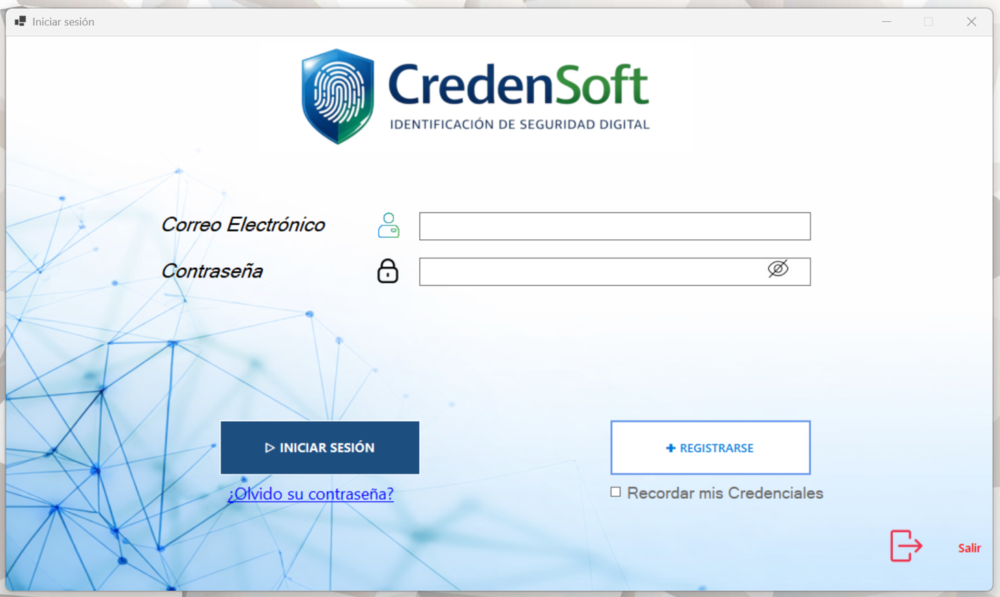
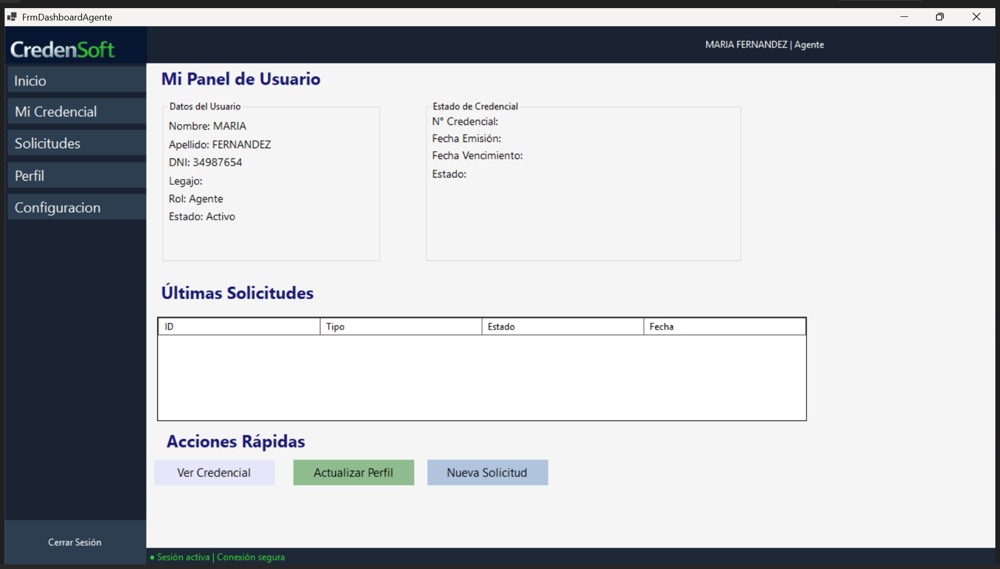
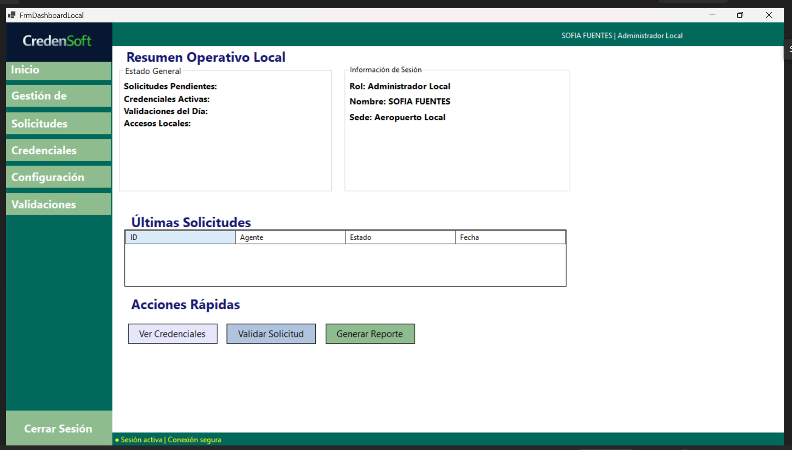
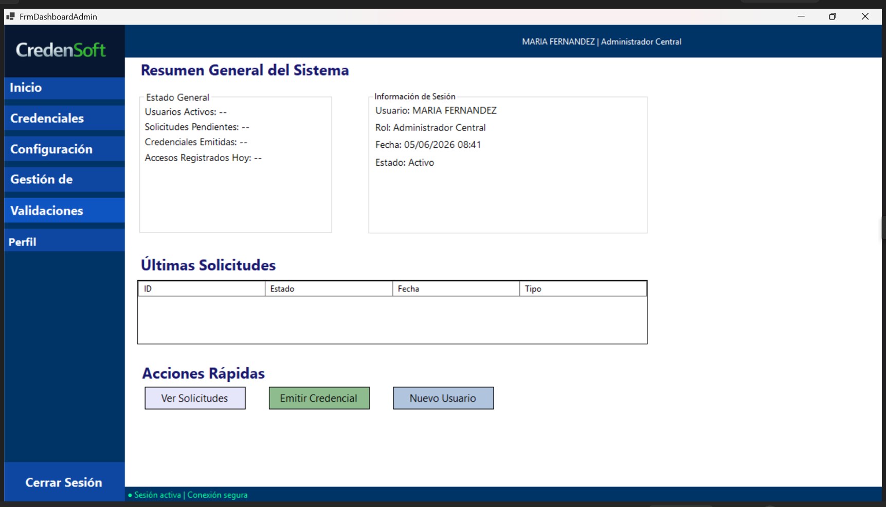

# CredenSoft

## Identificación de Seguridad Digital

CredenSoft es una aplicación de escritorio desarrollada como proyecto académico para la gestión de credenciales 
de seguridad.

El sistema permite gestionar usuarios, roles, credenciales, solicitudes y el seguimiento de los estados asociados, incorporando funcionalidades orientadas a la trazabilidad y organización de la información.

## Tecnologías utilizadas

- C#
- .NET 8
- Windows Forms
- Entity Framework Core
- SQL Server
- Git y GitHub
- Jira

## Funcionalidades principales

- Gestión de usuarios y roles
- Gestión de credenciales
- Gestión de solicitudes
- Seguimiento de estados
- Historial y trazabilidad
- Notificaciones
- Dashboards según el rol del usuario
- Validaciones de datos
- Gestión de documentos adjuntos

## Arquitectura y organización

El proyecto se encuentra organizado en diferentes componentes para separar las responsabilidades de la aplicación, incluyendo:

- `DataEF` — acceso y configuración de datos mediante Entity Framework Core.
- `ModelsEntidades` — entidades utilizadas por el sistema.
- `ServicesNegocio` — lógica y servicios de negocio.
- `SistemaCredenSoft.UI` — interfaz gráfica de la aplicación.
- `Migrations` — migraciones de Entity Framework Core.

## Trabajo en equipo

CredenSoft fue desarrollado en equipo de dos integrantes.

El trabajo se organizó mediante ramas independientes en Git y posteriormente se integraron los
cambios en la rama `main`.

### Integrantes

- **Gabriela Alegre** — participación en diseño inicial de base de datos, desarrollo de interfaz y formularios, dashboards, experiencia de usuario, integración y testing.
- **Ximena Martínez** — participación en desarrollo del backend y lógica de negocio.

> Las responsabilidades se distribuyeron durante el desarrollo y ambos aportes formaron parte de la integración final del proyecto.

## Estado del proyecto

Proyecto académico que estamos realizando para la Tecnicatura Superior en Desarrollo de Software.

El repositorio corresponde a una versión con fines educativos y de portfolio.

## Capturas de la aplicación

### Inicio de sesión

### Dashboard de Agente

### Gestión de usuarios

### Dashboard / Administración

